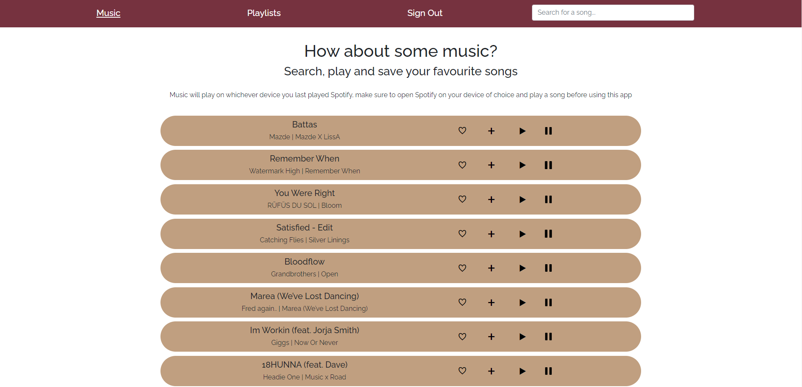

# Everything Spotify
> Alternative Spotify user interface

## Table of contents
* [General info](#general-info)
* [Screenshots](#screenshots)
* [Technologies](#technologies)
* [Setup](#setup)
* [Features](#features)
* [Status](#status)
* [Contact](#contact)

## General info
A project to test out my front end developer skills.

## Screenshot

## Technologies
* HTML
* CSS
* Javascript
* React
* Redux

## Setup
Users must have a Spotify premium account.

## Features
Features ready:
* Search for song titles using the Spotify API.
* Add songs from the search results to one of your existing playlists.
* Like songs from the search results.
* Play and pause song playback.

## Status
Project is finished.

## Contact
Created by [@joshuakent](josh.kent94@yahoo.co.uk) - feel free to contact me!